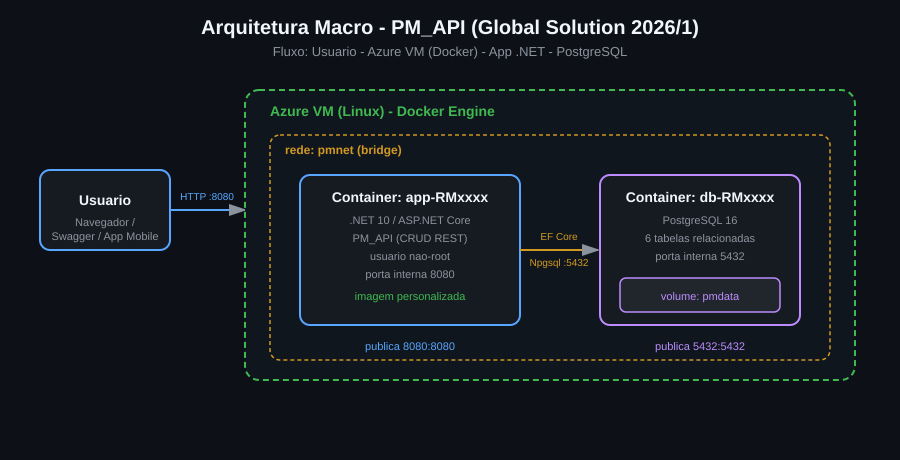

# PM_API - Global Solution 2026/1
## DevOps Tools & Cloud Computing

Conteinerizacao da API **PM_API** (.NET 10 / ASP.NET Core) com banco **PostgreSQL**, executando em ambiente de nuvem (Azure VM Linux) via **Docker Compose**, com dois containers integrados na mesma rede.

---

## Descrição da solução

O sistema PM (Problems Monitoring) e uma API REST para monitoramento de datacenters por meio de sensores, conectado ao tema da economia espacial (monitoramento de infraestrutura critica em solo de apoio a operacoes orbitais). A aplicacao expoe um CRUD completo sobre 6 entidades relacionadas (DataCenter, Sensor, TipoAlerta, Alerta, Funcionario, Manutencao), persistindo os dados em um banco PostgreSQL.

A arquitetura roda inteiramente em containers Docker numa VM em nuvem: um container para a aplicacao .NET (imagem personalizada gerada via Dockerfile, usuario nao privilegiado) e um container para o banco PostgreSQL (volume nomeado para persistencia). Ambos se comunicam por uma rede bridge dedicada.

---

## Arquitetura macro



Fluxo: o usuario acessa a aplicacao pela porta 8080 publicada na VM. O container do app (.NET) conversa com o container do banco (PostgreSQL) pela rede interna `pmnet`, usando o nome do servico como host. Os dados persistem no volume nomeado `pmdata`.

---

## Tecnologias

- .NET 10 / ASP.NET Core Web API
- Entity Framework Core + Npgsql (PostgreSQL)
- PostgreSQL 16
- Docker e Docker Compose
- Swagger / OpenAPI

---

## How to (passo a passo - do clone ate as evidencias)

### Pre-requisitos na VM
- Docker e Docker Compose instalados (`docker --version` e `docker compose version`)
- Portas 8080 e 5432 liberadas no Network Security Group da Azure VM

### 1. Clonar o repositório
```bash
git clone https://github.com/Nicomotac/GlobalSolution-DevOps-2026
cd API-GlobalSolution-1-2026
```

### 2. Subir os containers em background
```bash
docker compose up -d --build
```

### 3. Conferir que ambos estao rodando
```bash
docker compose ps
```

### 4. Exibir os logs de cada container
```bash
docker compose logs app-RM561857
docker compose logs db-RM561857
```

### 5. Acessar o terminal de cada container (evidencias exigidas)
```bash
# App: estrutura de diretorios e usuario conectado
docker container exec -it app-RM561857 sh -c "pwd && ls -l && whoami"

# Banco: estrutura de diretorios e usuario conectado
docker container exec -it db-RM561857 sh -c "pwd && ls -l && whoami"
```
> No container do app, `whoami` deve retornar **pmuser** (usuario nao privilegiado).

### 6. Testar a aplicacao (CRUD via Swagger)
No navegador: `http://<IP_PUBLICO_DA_VM>:8080/swagger`

Exemplos via terminal:
```bash
# CREATE - DataCenter
curl -X POST http://localhost:8080/api/DataCenter \
  -H "Content-Type: application/json" \
  -d '{"setor":"Infraestrutura","statusDatacenter":"Ativo"}'

# CREATE - Sensor (relacionado ao DataCenter id=1)
curl -X POST http://localhost:8080/api/Sensor \
  -H "Content-Type: application/json" \
  -d '{"tipoSensor":"Temperatura","unidadeMedida":"C","atividadeSensor":"Ativo","dataCenter_Id":1}'

# READ
curl http://localhost:8080/api/DataCenter
curl http://localhost:8080/api/Sensor
```

### 7. Evidenciar a persistencia no banco com SELECT (exigido)
```bash
docker container exec -it db-RM561857 psql -U pmuser -d pmdb -c "SELECT * FROM datacenter;"
docker container exec -it db-RM561857 psql -U pmuser -d pmdb -c "SELECT * FROM sensor;"
docker container exec -it db-RM561857 psql -U pmuser -d pmdb -c "\dt"
```

### 8. Encerrar (opcional)
```bash
docker compose down          # mantem o volume
docker compose down -v       # remove tambem o volume
```

---

## Checklist de requisitos atendidos

| Requisito | Onde |
|---|---|
| Imagem personalizada do app | `Dockerfile` (multi-stage) |
| Usuario nao privilegiado | `Dockerfile` (pmuser) |
| Diretorio de trabalho definido | `Dockerfile` (WORKDIR /app) |
| Variavel de ambiente no app | `docker-compose.yml` (ConnectionStrings__DefaultConnection) |
| Porta exposta do app | 8080 |
| Nome do container do app com RM | app-RM561857 |
| CRUD completo em >= 2 tabelas | 6 entidades relacionadas |
| App na mesma rede do banco | rede `pmnet` |
| Volume nomeado no banco | `pmdata` |
| Variavel de ambiente no banco | POSTGRES_* |
| Porta exposta do banco | 5432 |
| Nome do container do banco com RM | db-RM561857 |
| >= 2 tabelas com relacionamento | 6 tabelas com FKs |
| Containers em background | `up -d` |

---

## Integrantes
- RM561857 - Nicolas Mota Candido - 2TDSPI
- RM562979 - Caio Kenzo Tayra - 2TDSPI
- RM563000 - Enzo Vieira Bernardini - 2TDSPI

## Links
- Repositorio GitHub: <https://github.com/Caiok275/API-GlobalSolution-1-2026>
- Video no YouTube:
